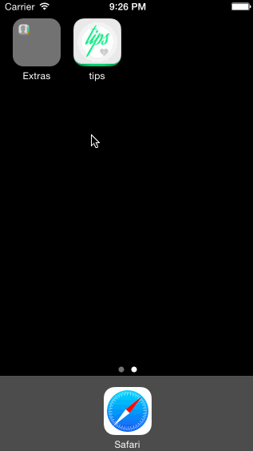

# Tip Calculator Demo

This is an iOS demo application that allows users to calculate tips given a specific bill amount.

Time spent: 2 hours spent in total for the basic app (walkthrough video)

Completed user stories:

* [x] Required: User can input a bill amount using the numerical keyboard to get a calculated tip and bill totals using 18% as default
* [x] Required: User can choose a total of 3 tip percentages (18%, 20% and 22%)
* [x] Optional: User can see bill split between 2, 3 and 4 people
* [x] Optional: Custom Launch screen has been designed
* [x] Optional: Custom App icon has been designed
* [x] Optional: App background colors has been updated to follow visual design theme
* [x] Optional: Overall app typography has been updated to follow visual design theme

Notes:

* Figured out another way to deal with the bridgeToObjectiveC issue using `billField.text as NSString` instead of `NSString(string: billField.text)` as per [this StackOverflow solution](http://stackoverflow.com/questions/24031621/swift-how-to-convert-string-to-double).

Walkthrough of all user stories:

GIF created with [LiceCap](http://www.cockos.com/licecap/).
